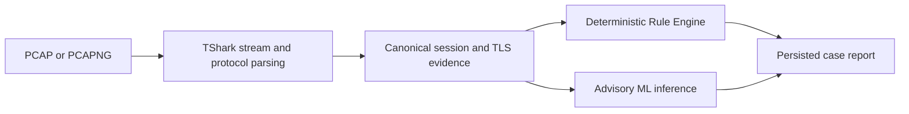

# SecureMailScope

SecureMailScope is an offline PCAP analysis framework for examining the transport security of SMTP, IMAP, and POP3 communications. It reconstructs TCP streams, extracts protocol and TLS observations, parses certificates when visible in the capture, evaluates deterministic policy checks, and stores a structured case report.

The project was prepared for SIH Problem Statement 26159, “SecureMailScope: AI-Assisted Cryptographic Security Posture Assessment for Secure Email Communications.”

## Analysis workflow



The Rule Engine and ML layer are separate. Rule results are deterministic checks against configured policy profiles. ML outputs are advisory and do not change policy findings or the deterministic posture heuristic. Missing or unobservable packet evidence is represented explicitly.

## Capabilities

- Reconstruct TCP streams from PCAP and PCAPNG input using TShark.
- Identify SMTP, IMAP, and POP3 from protocol evidence.
- Track SMTP STARTTLS, IMAP STARTTLS, POP3 STLS, and implicit TLS states.
- Extract observable TLS versions, cipher suites, key exchange details, extensions, and handshake state.
- Parse visible X.509 certificates and report certificate, hostname, chain, and trust-store observations supported by the capture.
- Evaluate NIST SP 800-52 Rev. 2, NIST SP 800-131A, and Mozilla Server Side TLS profiles through the deterministic Rule Engine.
- Compute a separate deterministic posture heuristic.
- Run cohort-routed ML classification and novelty inference with applicability, feature-coverage, and provenance information.
- Persist analyses in a local SQLite database and export case reports as JSON, HTML, or print-ready PDF.
- Add KEV and EPSS context only when a CVE relationship is explicitly supported; cryptographic properties do not independently establish a CVE.

## ML models and interpretation

The runtime routes models by protocol and available evidence:

| Model task | Runtime use | Training or reference data | Interpretation |
|---|---|---|---|
| SMTP risk rubric classification | SMTP sessions with sufficient evidence | 1,524 evaluable real ZGrab2 SMTP observations | Predicts a documented project rubric, not independent security ground truth |
| IMAP/POP3 posture classification | IMAP and POP3 sessions | 10,000 programmatically simulated feature rows | Experimental estimate; real-network effectiveness is not established |
| SMTP configuration novelty | SMTP sessions with observable TLS version and cipher | 469 real ZGrab2 SMTP TLS observations | Cohort-relative configuration novelty, not attack or vulnerability detection |
| Certificate novelty | Sessions with sufficient visible certificate features | 21,490 scan/HTTP-context certificate observations, 9,459 unique fingerprints | Distributional novelty; these are not complete SMTP handshake records |

Rule-derived proxy classifiers are supplementary research artifacts and are not independent risk models. A separate HTTPS TLS cohort is not used as an email detector. The application includes a technical report; see [the ML validation report](datasets/ml/ML_VALIDATION_REPORT.md) for label definitions, split methodology, metrics, confusion matrices, and limitations.

## Data provenance

The repository keeps unlike data sources separate:

| Data | Approximate size | Use and boundary |
|---|---:|---|
| Censys-derived targets measured with ZGrab2 | 1,600 SMTP observations; 1,524 successes; 530 TLS handshakes | Real active Internet scans, not passive PCAP captures |
| Controlled email testbed | 110 synthetic PCAP files and 116 parsed streams in the recorded runtime audit | Parser, Rule Engine, and runtime integration checks; not real-world traffic |
| Programmatic email feature simulation | 10,000 generated rows from 2,000 simulated endpoint profiles | Experimental IMAP/POP3 classifier training; not captured sessions or PCAPs |
| Real TLS PCAP cohort | 41,205 TLS 1.3 HTTPS observations | Separate general TLS novelty research; not email traffic |
| MTA-STS scan-context certificates | 21,490 parsed observations and 9,459 unique fingerprints | Certificate feature reference; not complete SMTP TLS handshakes |
| NVD, CISA KEV, EPSS, CWE, NIST, and OWASP | External intelligence and reference material | Enrichment and security context, not network classifier training data |

The public testbed capture directory is available at [testbed/captures](https://github.com/Ben160804/SES-v1/tree/master/testbed/captures). Dataset counts refer to project collection snapshots and can differ from upstream totals. Large source archives may be excluded from Git; see `.gitignore` and the dataset manifests under `datasets/ml/metadata/`.

## Requirements

- Python 3.11 or newer
- TShark, available on `PATH`
- Node.js and npm for the React frontend

Check that TShark is available before analyzing captures:

```bash
tshark --version
```

## Local setup

From the repository root:

```bash
python3 -m venv .venv
source .venv/bin/activate
python -m pip install --upgrade pip
python -m pip install -r requirements.txt
```

Build the frontend:

```bash
cd frontend
npm ci
npm run build
cd ..
```

Start the API and built frontend from the repository root:

```bash
python run.py
```

Open `http://127.0.0.1:8000`. The API health endpoint is `http://127.0.0.1:8000/api/v1/health` and the OpenAPI document is available at `http://127.0.0.1:8000/docs`.

For frontend development, leave the API running and start Vite in another terminal:

```bash
cd frontend
npm run dev
```

Open `http://127.0.0.1:5173`. Vite proxies API requests to `http://127.0.0.1:8000` by default; set `SECUREMAILSCOPE_API_URL` to use another development API address.

## Tests and checks

Install the Python test dependency and run the suite from the repository root:

```bash
python -m pip install -r requirements-dev.txt
pytest
```

Run frontend checks from `frontend/`:

```bash
npm run typecheck
npm test
npm run build
```

The synthetic PCAP suite validates implementation behavior for its documented scenarios. It does not establish model effectiveness on real email traffic.

## Storage and security scope

Analysis records are stored in `data/securemailscope.sqlite` by default. Set `SECUREMAILSCOPE_DB` to choose another database path. The database and uploaded raw PCAP files are not committed to the repository. The current API is intended for a local, single-operator workflow and does not provide user authentication or multi-tenant authorization; keep it bound to loopback unless access controls are added.

SecureMailScope analyzes packet evidence passively. It does not probe remote endpoints during PCAP analysis. A missing TLS or certificate field means the evidence was not observable in the supplied capture; it does not establish that the remote service lacks that property.

## Repository map

```text
analysis/       PCAP parsing, protocol state, certificate processing, rules, ML runtime, API, storage
data/           Policy inputs, protocol/cipher references, and testbed scenario contracts
datasets/       Collected data, feature preparation, model training, evaluation, and model artifacts
docs/           Project notes, data audits, and supporting technical documents
frontend/       React and TypeScript application
testbed/        Synthetic capture corpus, generation and comparison tooling, isolated service configs
tests/          Python API, parser, rules, ML, storage, and threat-context tests
```
